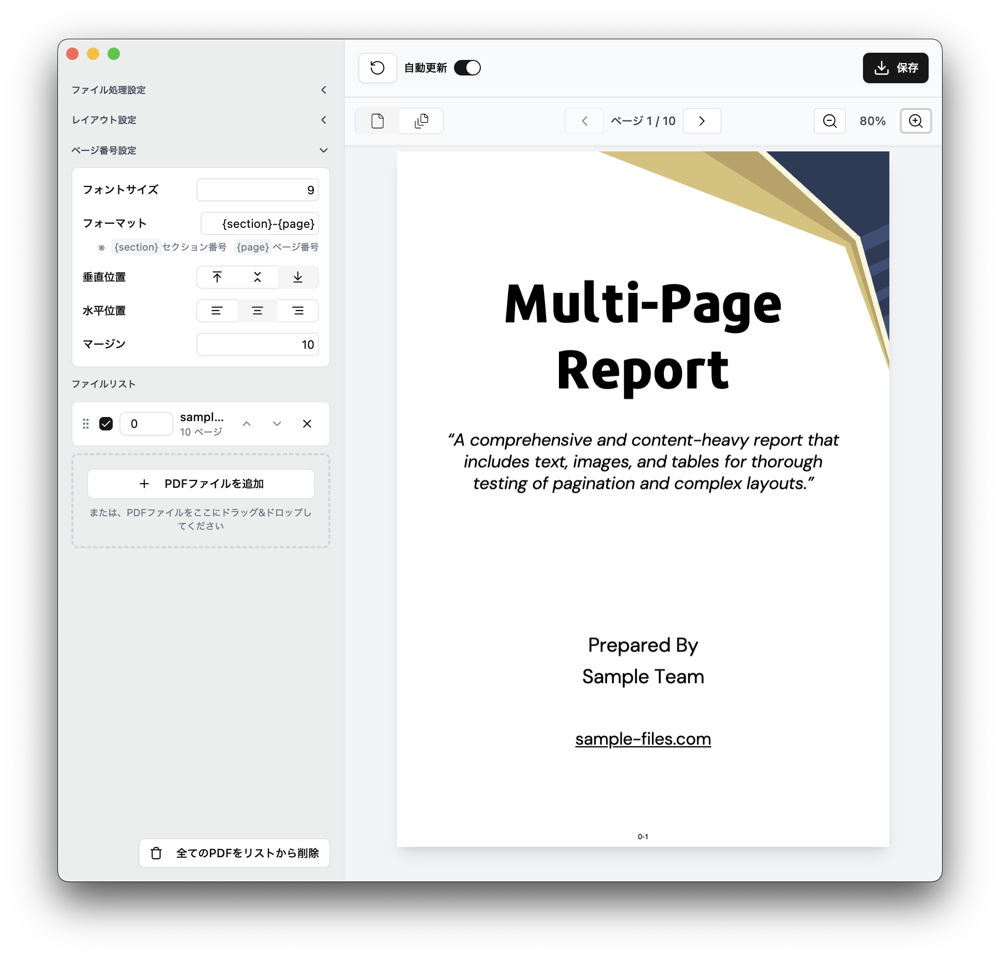

# PDF2Doc App

注釈をフラット化し、PDFファイルにページ番号を追加するElectronアプリケーションです。



## 機能

### 主要機能
- **PDFファイルのアップロードと管理**: 複数のPDFファイルをセクションとして管理
- **ページ番号の自動追加**: カスタマイズ可能なフォーマットでページ番号を追加
- **セクション間の空白ページ追加**: セクション間に空白ページを挿入
- **注釈のフラット化**: Ghostscriptを使用してPDFの注釈をフラット化
- **レイアウトの強制変換**: 縦向き/横向きの強制変換
- **リアルタイムプレビュー**: 処理結果をリアルタイムでプレビュー

### ページ番号設定
- **カスタムフォーマット**: `{section}-{page}`形式でページ番号をカスタマイズ
- **位置調整**: 水平・垂直位置を自由に設定
- **フォントサイズ**: ページ番号のフォントサイズを調整
- **余白設定**: ページ番号の余白を調整

### レイアウト設定
- **向きの制御**: 自動/縦向き/横向きの選択
- **空白ページ**: セクション間の空白ページ追加オプション

## 必要な環境

### Node.js
- Node.js 18.0.0以上

### Ghostscript（フラット化機能を使用する場合）
PDFの注釈をフラット化する機能を使用するには、Ghostscriptをインストールする必要があります。

#### macOS
```bash
# Homebrewを使用
brew install ghostscript

# または、MacPortsを使用
sudo port install ghostscript
```

#### Windows
1. [Ghostscript公式サイト](https://www.ghostscript.com/releases/gsdnld.html)からインストーラーをダウンロード
2. インストーラーを実行
3. システム環境変数PATHにGhostscriptのbinディレクトリを追加

#### Linux (Ubuntu/Debian)
```bash
sudo apt-get update
sudo apt-get install ghostscript
```

#### Linux (CentOS/RHEL/Fedora)
```bash
# CentOS/RHEL
sudo yum install ghostscript

# Fedora
sudo dnf install ghostscript
```

## インストールと実行

### 依存関係のインストール
```bash
pnpm install
```

### 開発モードで実行
```bash
pnpm dev
```

### ビルド
```bash
pnpm build
```

### アプリケーションのパッケージ化

#### 全プラットフォーム
```bash
pnpm pack
```

#### 特定のプラットフォーム
```bash
# macOS
pnpm pack:mac

# Windows
pnpm pack:win

# Linux
pnpm pack:linux

# 全プラットフォーム
pnpm pack:all
```

## 使用方法

### 基本的な使用手順

1. **PDFファイルをアップロード**
   - 「ファイルを追加」ボタンをクリック
   - 複数のPDFファイルを選択可能
   - 各ファイルはセクションとして管理されます

2. **設定を調整**
   - **ファイル処理設定**
     - セクション間に空白ページを追加
     - 既存の注釈をフラット化（Ghostscriptが必要）
   - **レイアウト設定**
     - 向き: 自動/縦向き/横向き
   - **ページ番号設定**
     - フォントサイズ
     - フォーマット（例: `{section}-{page}`）
     - 水平・垂直位置
     - 余白

3. **変換実行**
   - 「変換」ボタンをクリック
   - 処理の進行状況が表示されます

4. **結果の確認とダウンロード**
   - プレビューで結果を確認
   - 処理されたPDFをダウンロード

### ページ番号フォーマット

ページ番号は以下のプレースホルダーを使用してカスタマイズできます：

- `{section}`: セクション番号
- `{page}`: ページ番号

**例:**
- `{section}-{page}` → `1-1`, `1-2`, `2-1`, `2-2`
- `Section {section} Page {page}` → `Section 1 Page 1`, `Section 1 Page 2`

## 技術スタック

### フロントエンド
- **React 19**: 最新のReactフレームワーク
- **TypeScript**: 型安全な開発
- **Vite**: 高速なビルドツール
- **Tailwind CSS**: ユーティリティファーストCSS
- **Radix UI**: アクセシブルなUIコンポーネント
- **Lucide React**: アイコンライブラリ

### PDF処理
- **pdf-lib**: PDFの作成・編集
- **pdfjs-dist**: PDFの表示・プレビュー
- **react-pdf**: PDFビューアーコンポーネント
- **Ghostscript**: 注釈のフラット化

### デスクトップ
- **Electron**: クロスプラットフォームデスクトップアプリケーション
- **electron-builder**: アプリケーションのパッケージ化

### 開発ツール
- **ESLint**: コード品質管理
- **pnpm**: 高速なパッケージマネージャー

## プロジェクト構造

```
pdf2doc-app/
├── electron/              # Electronメインプロセス
│   ├── main.ts           # メインプロセスエントリーポイント
│   ├── preload.ts        # プリロードスクリプト
│   └── menu.ts           # アプリケーションメニュー
├── src/                  # Reactアプリケーション
│   ├── components/       # UIコンポーネント
│   │   ├── ui/          # 基本UIコンポーネント（Radix UI）
│   │   ├── ConfigForm.tsx    # 設定フォーム
│   │   ├── FileList.tsx      # ファイルリスト
│   │   ├── Preview.tsx       # PDFプレビュー
│   │   └── Toolbar.tsx       # ツールバー
│   ├── lib/             # ユーティリティ関数
│   │   └── utils.ts     # PDF処理・Ghostscript関連
│   ├── types/           # TypeScript型定義
│   │   └── index.ts     # アプリケーション型定義
│   ├── App.tsx          # メインアプリケーション
│   └── main.tsx         # Reactエントリーポイント
├── public/              # 静的ファイル
│   ├── cmaps/           # PDF文字マッピング
│   ├── standard_fonts/  # 標準フォント
│   └── pdf.worker.min.mjs # PDF.jsワーカー
├── electron-builder.json5 # ビルド設定
├── vite.config.ts       # Vite設定
└── package.json         # プロジェクト設定
```

## 開発

### 開発環境のセットアップ

1. リポジトリをクローン
```bash
git clone <repository-url>
cd pdf2doc-app
```

2. 依存関係をインストール
```bash
pnpm install
```

3. 開発サーバーを起動
```bash
pnpm dev
```

### コード品質

```bash
# リント実行
pnpm lint
```

### ビルドとパッケージ化

```bash
# 開発用ビルド
pnpm build

# アプリケーションのパッケージ化
pnpm pack
```

## 貢献

1. このリポジトリをフォーク
2. 機能ブランチを作成 (`git checkout -b feature/amazing-feature`)
3. 変更をコミット (`git commit -m 'Add some amazing feature'`)
4. ブランチにプッシュ (`git push origin feature/amazing-feature`)
5. プルリクエストを作成

### 開発ガイドライン

- TypeScriptの型安全性を保つ
- ESLintルールに従う
- コンポーネントは再利用可能に設計する
- アクセシビリティを考慮する

## トラブルシューティング

### Ghostscriptが見つからない場合

1. Ghostscriptが正しくインストールされているか確認
2. システムのPATHにGhostscriptが含まれているか確認
3. アプリケーションを再起動

### PDFの処理に失敗する場合

1. PDFファイルが破損していないか確認
2. ファイルサイズが大きすぎないか確認
3. 十分なメモリが利用可能か確認

## ライセンス

このプロジェクトはMITライセンスの下で公開されています。

## 更新履歴

### v0.0.0
- 初期リリース
- PDFページ番号追加機能
- 注釈フラット化機能
- レイアウト変換機能
- リアルタイムプレビュー機能
